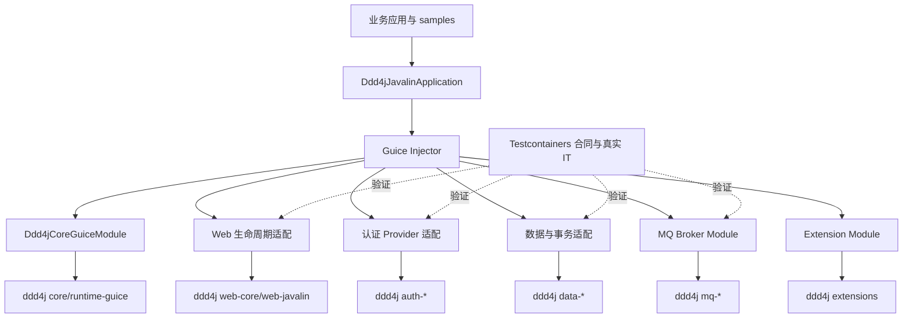
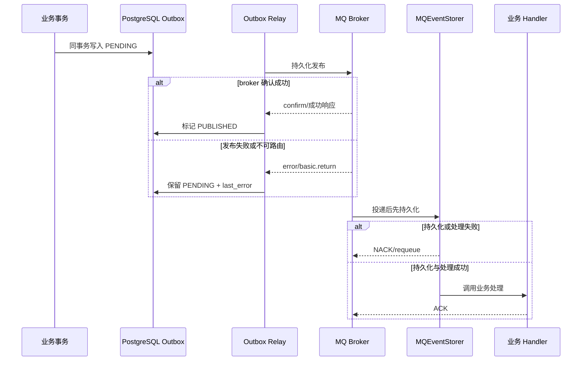
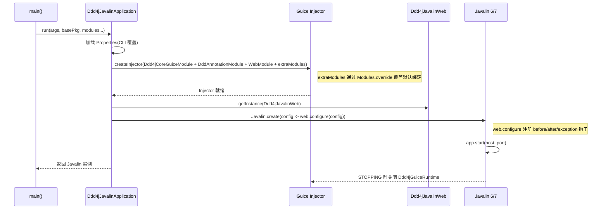

# ddd4j-javalin 架构

## 架构定位

`ddd4j-javalin` 是框架适配层，不复制 ddd4j 的领域模型、Repository 或 MQ 实现。它通过 Guice 将
ddd4j 的运行时端口装配到 Javalin，并补齐 Boot 自动配置在非 Spring 场景中的消费者体验。

## 模块边界

| 边界 | Javalin 层职责 | ddd4j 权威实现 |
|---|---|---|
| Core | 安装完整 `Ddd4jGuiceModule`，管理 Injector 与关闭生命周期 | CommandBus、事件、投影和全局 SPI |
| Web | 请求上下文、鉴权策略、异常翻译、幂等、CORS、上传限制与超时 | `WebRequestLifecycle`、`Ddd4jJavalinWeb` |
| Auth | 将 SubjectProvider 装入 Guice；OIDC 提供通用 JWT/JWKS 资源服务器能力 | Sa-Token、Security、Shiro 原生 Provider |
| Data | Repository 注册、JPA EntityManagerFactory 与事务模板、DataScope/External/Data Logs 消费装配 | MyBatis/JPA/日志与数据端口 |
| MQ | 每个 Broker 的 Client/Properties 单例绑定 | 发布、消费、ACK/NACK、持久化与投递策略 |
| Extensions | 对有效上游扩展提供直接复用或轻量装配 | Excel、Monitor、PF4J、QLExpress、QRCode、Validation |

OIDC 与原生认证模块具有不同边界：只有 `ddd4j-javalin-auth-oidc` 负责 Keycloak JWT 验签与 HTTP
allow/deny；Sa-Token、Spring Security 和 Shiro 的 Keycloak 测试只证明容器兼容性，不宣称原生模块
直接消费 OIDC token。

## 可靠消息链路

RabbitMQ 已具备 persistent delivery、publisher confirm、`mandatory=true`、不可路由 return 失败、
持久化失败 NACK/requeue 与恢复后 ACK 的真实容器契约。其他 Broker 共享 ddd4j MQ 核心的 Inbox、
Outbox、重试与 DEAD 策略，但其协议级失败恢复证据必须按 Broker 独立核验，不能由普通 round-trip 代替。

## 测试基础设施边界

Testcontainers 固定为 `1.20.6`。MySQL、PostgreSQL、MariaDB、MongoDB、Kafka、RabbitMQ 与
LocalStack 优先使用 Testcontainers Java 的专用容器类型；无兼容专用模块的服务使用固定镜像标签的
`GenericContainer`。ONS 与 TDMQ 属于托管服务排除项，Mica MQTT 保留已记录的上游限制。Testcontainers
目录对“官方模块”和“社区模块”有明确区分，不能把任意 Docker 镜像称为官方模块。

## 启动序列

