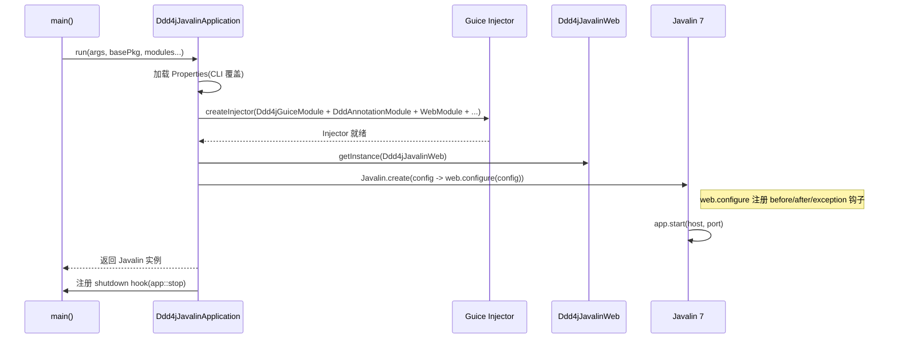

# ddd4j-javalin 架构

## 三层架构

```
┌─────────────────────────────────────────────────────────────┐
│                  ddd4j-javalin-samples                      │
│      (rich-model / auth-* / mq-* / mybatis-testcontainers)  │
└─────────────────────┬───────────────────────────────────────┘
                      │ depends on
┌─────────────────────▼───────────────────────────────────────┐
│           ddd4j-javalin-* 适配层 (本仓库)                   │
│  ┌─────────┬─────────┬─────────┬──────────┬──────────────┐  │
│  │  web    │  data   │  auth   │   mq     │ extensions   │  │
│  │ Ddd4j   │ mybatis │ satoken │ 14broker │ qrcode       │  │
│  │ Javalin │ jpa     │ shiro   │ core+    │ qlexpress    │  │
│  │ App     │ logs    │ security│ kafka/   │ jackson      │  │
│  │ Web     │ data-   │ license │ rabbitmq │ monitor      │  │
│  │ Test    │ scope   │         │ redis/   │ pf4j/akka    │  │
│  │ Fixture │ external│         │ rocket/  │ excel        │  │
│  └─────────┴─────────┴─────────┴──────────┴──────────────┘  │
│  ┌──────────────────────────────────────────────────────┐  │
│  │      ddd4j-javalin-testcontainers (Testcontainers)   │  │
│  │  MySQL/Postgres/MariaDB/Mongo/Redis/Kafka/RabbitMQ  │  │
│  │  ActiveMQ/RocketMQ/Pulsar/NATS/MQTT/SQS/Keycloak    │  │
│  └──────────────────────────────────────────────────────┘  │
└─────────────────────┬───────────────────────────────────────┘
                      │ depends on
┌─────────────────────▼───────────────────────────────────────┐
│                       ddd4j 核心                            │
│  ┌─────────┬──────────┬─────────┬──────────┬────────────┐   │
│  │ ddd4j-  │ ddd4j-   │ ddd4j-  │ ddd4j-   │ ddd4j-     │   │
│  │ core    │ web-core │ data-*  │ auth-*   │ mq-*       │   │
│  │         │ web-     │ cache   │ license  │ extensions │   │
│  │         │ javalin  │ crypto  │          │            │   │
│  │         │ runtime- │ datascope│         │            │   │
│  │         │ guice    │ logs    │          │            │   │
│  │         │          │ external│          │            │   │
│  └─────────┴──────────┴─────────┴──────────┴────────────┘   │
└─────────────────────────────────────────────────────────────┘
```

## 启动序列

