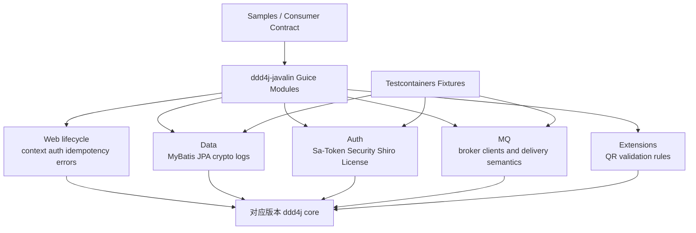
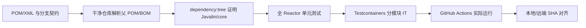

# ddd4j-javalin 三分支收敛与验证设计

- **日期**：2026-09-07
- **状态**：待实施（设计已在会话中批准，待文件审阅）
- **目标**：将 `feature/6.7.x`、`feature/7.1.x`、`feature/7.2.x` 分别收敛到 ddd4j 1.0.x、2.0.x、3.0.x，并以版本解析、单元测试、Testcontainers round-trip 和 GitHub Actions 形成可复验的三线证据。
- **规格事实源**：本文件；历史能力矩阵、Testcontainers 和生产就绪文档作为背景资料，不覆盖本文件的三线版本约束。

## 1. 背景与现状

本仓库已有较完整的 Guice + Javalin 适配实现、共享 Testcontainers Fixture、MQ round-trip IT 和三个版本分支，但正式分支尚未形成一致、可构建、可由 CI 复验的版本矩阵。

2026-09-07 只读审计确认：

| 分支 | 当前问题 |
|---|---|
| `feature/6.7.x` | 正式分支仍指向 `ddd4j 2.0.x.20260730-SNAPSHOT`；完成 1.0.x 改挂和兼容桥的成果位于 `opt/retarget-1.0.x`，尚未收敛进正式分支；`javalin.version=7.2.2` 仅用于父 BOM 解析、实际依赖另由 `javalin6.version=6.7.0` 覆盖，表达不清晰。 |
| `feature/7.1.x` | 指向过期的 `ddd4j 2.0.x.20260730-SNAPSHOT`；错误使用 Maven 4 `modelVersion 4.1.0` 和 `<subprojects>`；CI workflow 仍监听 `feature/7.2.x`，因此本分支没有 Actions 运行记录。 |
| `feature/7.2.x` | ddd4j/Javalin/项目版本声明正确；Maven 4 聚合结构正确；独立 IT workflow 仍使用 JDK 17，而 ddd4j 3.0.x 基线要求 JDK 21；最新 CI 在上游 3.0.x 父 POM 解析阶段失败。 |

上游 ddd4j 1.0.x、2.0.x 已出现成功 deploy 记录；3.0.x 最新 deploy 尚未成功。上游发布状态必须作为 7.2.x 远程消费验证的前置证据，不能以本地 Maven 缓存代替。

## 2. 目标版本矩阵

| ddd4j-javalin 分支 | 项目版本 | Javalin | ddd4j | Maven 模型 | 构建 JDK |
|---|---|---|---|---|---|
| `feature/6.7.x` | `6.7.x.20260630-SNAPSHOT` | `6.7.0` | `1.0.x.20260630-SNAPSHOT` | Maven 3 / `4.0.0` / `<modules>` | JDK 17（消费 Java 8 core） |
| `feature/7.1.x` | `7.1.x.20260630-SNAPSHOT` | `7.1.0` | `2.0.x.20260630-SNAPSHOT` | Maven 3 / `4.0.0` / `<modules>` | JDK 17 |
| `feature/7.2.x` | `7.2.x.20260630-SNAPSHOT` | `7.2.3` | `3.0.x.20260630-SNAPSHOT` | Maven 4 / `4.1.0` / `<subprojects>` | JDK 21 |

### 2.1 强制约束

1. 使用 ddd4j 1.0.x 或 2.0.x 的分支必须采用 Maven 3 模型：命名空间/POM schema `4.0.0`、`modelVersion 4.0.0`、聚合元素 `<modules>/<module>`。
2. 使用 ddd4j 3.0.x 的分支必须采用 Maven 4 模型：命名空间/POM schema `4.1.0`、`modelVersion 4.1.0`、聚合元素 `<subprojects>/<subproject>`。
3. `feature/7.1.x` 不允许保留 Maven 4 wrapper、`4.1.0` schema 或 `<subprojects>`。
4. 每条分支只能声明一个清晰的 Javalin 运行版本；6.7.x 不得再用 `javalin.version=7.2.2` 表示一个非运行时版本。
5. 不使用 Git worktree，不创建新 worktree，不以已有 worktree 作为实现或验证目录。
6. 不覆盖 `ddd4j-boot` 当前未提交修改；该仓库仅作为能力参考。
7. 未经单独授权不 push；跨正式分支应用变更前需要可追踪的本地提交，因此在进入跨分支阶段前单独确认本地 commit 授权。

## 3. 收敛策略

采用“候选成果收敛”方案，保留已有验证过的实现，避免重新实现相同能力。

### 3.1 feature/6.7.x

以 `opt/retarget-1.0.x` 为 1.0.x 兼容候选基线，逐项吸收正式 `feature/6.7.x` 在候选分叉后新增的 Web、auth-core、Surefire 和文档修复。不得直接按分支头盲目覆盖；合并前先生成提交清单和冲突矩阵，按以下类别裁决：

- **必须保留候选实现**：`ddd4j-javalin-guice-bridge`、1.0.x 缺失契约的兼容实现、Javalin 6 API 适配、1.0.x 依赖版本。
- **必须吸收正式分支实现**：后续 Web 6 API 修复、auth-core 对称性修复、测试解锁。
- **需要人工审查**：README/历史状态、被内联的核心契约、与上游 1.0.x 新部署构件重复的兼容代码。

兼容桥仅用于填补 ddd4j 1.0.x 确实不存在的能力。若新部署的 1.0.x 已提供等价公共类型，应删除重复内联实现并改为依赖上游，避免形成第二套核心。

### 3.2 feature/7.1.x

保持现有 Javalin 7.1 API 适配和 core 2.0.x 专有模块，执行以下收敛：

- `ddd4j.version` 和父 POM统一为 `2.0.x.20260630-SNAPSHOT`。
- 所有 POM 从 Maven 4 语法恢复为 Maven 3 语法。
- Maven wrapper 固定到经 ddd4j 2.0.x 验证的 Maven 3 版本。
- workflow 名称、触发分支、JDK 和注释全部改为 7.1.x/ddd4j 2.0.x，不复用错误的 7.2.x 文案。

### 3.3 feature/7.2.x

保留 Maven 4 `4.1.0/<subprojects>` 和 Javalin 7.2.3，修正 CI/IT 为 JDK 21 + Maven 4 wrapper。远程消费验证必须等待 ddd4j 3.0.x deploy 成功并可从干净 Maven 仓库解析。

## 4. 能力对齐边界

ddd4j-javalin 对齐的是 ddd4j-boot 的业务能力，不复制 Spring Boot 自动配置实现：

三线共享能力以消费者可观察行为为准：

- 应用可启动和停止，配置端口生效。
- 请求上下文、认证、访问策略、异常翻译和幂等生命周期正确闭合。
- 数据模块执行真实 CRUD/事务 round-trip。
- MQ 模块执行 publish → broker → consume → acknowledgment round-trip。
- auth 模块验证实际登录/鉴权结果，而不是只验证 Guice binding 存在。
- 分支因上游版本缺失而排除模块时，必须在矩阵中记录原因，不能用空 POM 或跳过测试冒充实现。

## 5. Testcontainers 设计

### 5.1 版本策略

本次继续使用 `testcontainers-bom 1.20.6`，避免把三分支收敛与 Testcontainers 2.x 主版本升级混为一个变更。官方 modules 目录用于确认 Java 模块类别、推荐容器类型和镜像家族；实际 tag 必须结合 ARM64、上游客户端协议和既有 round-trip 证据锁定。

### 5.2 容器矩阵

| 能力 | 容器/API | 镜像基线 | 验证行为 |
|---|---|---|---|
| MySQL | `MySQLContainer` | `mysql:8.0` | schema + CRUD + transaction |
| PostgreSQL | `PostgreSQLContainer` | `postgres:16-alpine` | outbox/数据 round-trip |
| MariaDB | `MariaDBContainer` | `mariadb:11` | JDBC readiness/CRUD |
| MongoDB | `MongoDBContainer` | `mongo:7` | connection + document round-trip |
| Redis | `GenericContainer`（1.20.6 兼容） | `redis:7-alpine` | ping + stream/cache round-trip |
| Kafka | `KafkaContainer` | 先保留已验证的 `confluentinc/cp-kafka:7.5.0` | publish/consume/ack |
| RabbitMQ | `RabbitMQContainer` | `rabbitmq:3.13.7-management-alpine` | exchange/bind/publish/consume |
| Artemis | `GenericContainer` | `apache/activemq-artemis:2.39.0` | JMS round-trip |
| RocketMQ | `GenericContainer` | `apache/rocketmq:5.3.2` | nameserver+broker round-trip |
| Pulsar | `GenericContainer` | `apachepulsar/pulsar:3.2.0` | namespace ready + round-trip |
| NATS | `GenericContainer` | `nats:2-alpine` | publish/subscribe |
| MQTT | `GenericContainer` | `eclipse-mosquitto:2.0` | publish/subscribe |
| SQS | `LocalStackContainer`，若 1.20.6 API兼容 | `localstack/localstack:3.4` | queue/send/receive/delete |
| Keycloak | `KeycloakContainer` 社区模块 | `quay.io/keycloak/keycloak:24.0` | realm/token/auth decision |
| WireMock | 模块或兼容 `GenericContainer` | `wiremock/wiremock:3.5.0` | stubbed HTTP response |

ONS 和 TDMQ 是托管服务，没有本地开源等价镜像，继续作为明确排除项。Mica MQTT 只有在测试方法实际带有 `@Disabled` 或以独立可观察失败记录证明不兼容时才可跳过；注释不能代替禁用机制和测试报告。

## 6. GitHub Actions 与私服配置

组织级 `MAVEN_SETTINGS_XML` 是唯一必需的私服配置输入。workflow 必须：

1. 通过 `env` 读取 secret，按原始 XML 写入权限为 `0600` 的 `~/.m2/settings.xml`。
2. 校验文件非空且是可解析 XML，但不输出内容。
3. 使用 Maven 自身的只读解析命令验证私服访问；不得再依赖未配置的 `ALIYUN_PACKAGES_USERNAME/PASSWORD` 做独立 curl 自检。
4. 6.7.x/7.1.x 使用 JDK 17 + Maven 3；7.2.x 使用 JDK 21 + Maven 4 wrapper。
5. workflow 的 `push`、`pull_request`、concurrency group 和说明必须匹配所在分支。
6. Testcontainers 矩阵默认是验收门禁；只有已登记的上游缺陷可以针对单项显式豁免，不能对整个 job 使用 `continue-on-error: true`。

## 7. TDD 与验证门禁

### 7.1 RED

先增加可执行的分支契约验证，确保当前状态失败，至少覆盖：

- 分支名 → 项目版本 → ddd4j 版本 → Javalin 版本 → Maven 模型 → JDK 的精确映射。
- 7.1.x 出现 `4.1.0`、`<subprojects>` 或 Maven 4 wrapper 时失败。
- 7.2.x 出现 `<modules>` 或非 JDK 21 workflow 时失败。
- workflow 监听错误分支、未消费 `MAVEN_SETTINGS_XML`、整体 `continue-on-error` 时失败。
- Fixture 镜像未锁版本、IT 仅启动容器而没有业务 round-trip 断言时失败。

### 7.2 GREEN

只实施使上述契约和对应功能测试通过的最小变更。版本迁移不得顺带升级无关依赖。

### 7.3 分层验证

每层只证明自身，不得互相替代：编译通过不等于测试通过；本地缓存通过不等于远程发布可消费；workflow 文件存在不等于 Actions 绿灯。

## 8. 验收标准

1. 三条正式分支的版本矩阵与第 2 节完全一致。
2. 6.7.x/7.1.x 所有生产 POM 均为 Maven 3 模型；7.2.x 所有生产 POM 均为 Maven 4 模型。
3. `dependency:tree` 分别解析到 Javalin `6.7.0`、`7.1.0`、`7.2.3`，不存在同一分支的 Javalin 主版本混用。
4. 从隔离的临时 Maven repository 解析对应 ddd4j SNAPSHOT，证明发布产物完整，不依赖开发机旧缓存。
5. 每条分支全 Reactor 单测实际执行且零失败；报告必须包含测试数量和跳过数量。
6. 数据库、Auth、MQ Testcontainers IT 按矩阵执行真实 round-trip；每个失败有独立根因，不能整体忽略。
7. 三条分支 GitHub Actions 均产生与最终提交 SHA 对应的运行记录；必需 job 全绿。
8. 文档中的能力、版本、镜像、测试数量和已知排除项与实际代码/报告一致。
9. `git diff --check`、XML 解析和旧版本/旧聚合标签残留扫描通过。
10. 未使用或创建 Git worktree，未覆盖 `ddd4j-boot` 用户修改。

## 9. 非目标

- 不把 Testcontainers 升级到 2.x。
- 不修改 ddd4j-boot 业务实现。
- 不重写 ddd4j 三条核心分支的领域能力；若发布产物不完整，只记录并回到上游修复/deploy。
- 不为 ONS/TDMQ 构造不真实的本地替代实现。
- 不在未获得授权时 push、重写历史或删除现有分支/worktree 元数据。

## 10. 风险与对策

| 风险 | 对策 |
|---|---|
| 6.7 候选分支内联了已由新 1.0.x 发布提供的类型 | 先做类/构件清单差分，只保留真实缺口。 |
| Maven SNAPSHOT 元数据缓存导致假通过 | 使用独立临时 local repository 加 `-U` 验证。 |
| 三分支连续修改落错分支 | 每次写入前后记录 branch、HEAD、status；跨分支依赖本地提交检查点，不使用 worktree。 |
| 容器并行导致 ARM64/OOM 不稳定 | 按 broker 分批串行执行；保留已有内存和 readiness 策略。 |
| 3.0.x 尚未成功 deploy | 7.2.x 本地结构验证可继续，远程消费/CI 完成状态保持阻塞，直到上游 deploy 有成功证据。 |
| 私服凭据泄漏 | workflow 不打印 settings；另行轮换本地 remote URL 中暴露过的 Codeup 凭据。 |
